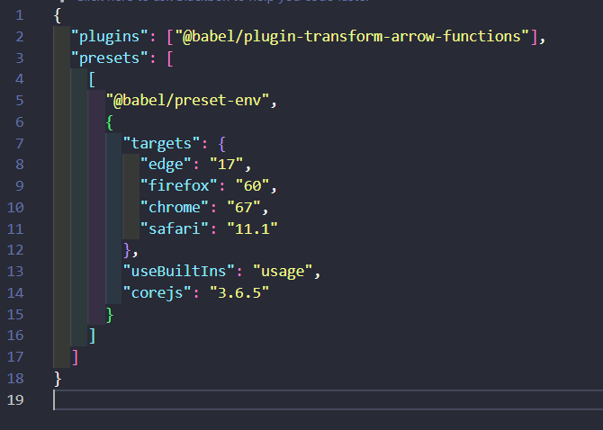
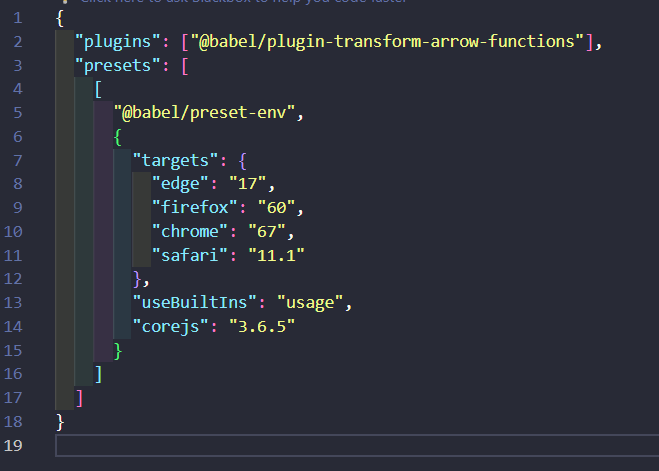

# Babel-Transpilation-Project

For this project we took a look at Babel. Transpilation project from javascript with ES2015 and to an older version of JavaScript.

## Step 1

First we need to create a new repository on github. After cloning the repository we need to create a npm package. We do then set up the config file.

## Step 2

Second step of the project. This is where we set up our development environment and install all necessary packages for
Create a new file called `app.js` in the root directory of your project and add the following code to it:
javascript

## Babel JS

With babel we can take advantage of ES6 features such as arrow functions, template literals, classes etc., which are not
javascript. You will need to create a config file and set up the versions of the browers for the transpiler to target. This can be done in the package.json or the config file.

